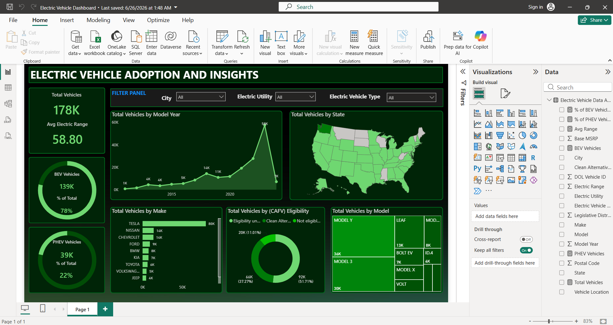

# Electric Vehicle Adoption Analysis using Power BI

## Overview

This project presents an interactive Power BI dashboard that analyzes electric vehicle (EV) adoption trends using real-world registration data. The dashboard provides insights into vehicle distribution, manufacturer performance, electric range, CAFV eligibility, and regional adoption patterns through interactive visualizations and KPIs.

The objective of this project is to transform raw EV data into meaningful business insights that can support decision-making for policymakers, utility providers, and the automotive industry.

---

## Dashboard Preview

---

## Problem Statement

As electric vehicles continue to gain popularity, understanding adoption trends and infrastructure requirements has become increasingly important. This project analyzes electric vehicle registration data to identify growth patterns, regional distribution, vehicle performance, and eligibility for Clean Alternative Fuel Vehicle (CAFV) incentives.

The dashboard enables users to explore EV adoption interactively and uncover valuable insights for future planning and policy development.

---

## Dataset Information

The dataset contains information about registered electric vehicles, including:

- Vehicle Make
- Vehicle Model
- Model Year
- Electric Vehicle Type
- Electric Range
- Clean Alternative Fuel Vehicle (CAFV) Eligibility
- County
- City
- State
- Postal Code
- Electric Utility Provider
- Legislative District

---

## Dashboard Features

- Interactive KPI Cards
- EV Adoption Trends by Model Year
- Manufacturer-wise Vehicle Distribution
- Electric Range Analysis
- CAFV Eligibility Analysis
- Geographic Distribution of Electric Vehicles
- Utility Provider Analysis
- Interactive Filters and Slicers
- Dynamic Data Exploration

---

## Key Performance Indicators (KPIs)

- Total Electric Vehicles
- Average Electric Range
- Total Vehicle Makes
- Total Vehicle Models
- Battery Electric Vehicles (BEVs)
- Plug-in Hybrid Electric Vehicles (PHEVs)
- CAFV Eligible Vehicles

---

## Tools & Technologies

- Power BI Desktop
- Power Query
- DAX (Data Analysis Expressions)
- CSV Dataset

---

## Skills Demonstrated

- Data Cleaning
- Data Transformation
- Data Modeling
- DAX Measures
- Power Query
- Dashboard Design
- Interactive Reporting
- Business Intelligence
- Data Visualization
- KPI Development

---

## Key Insights

- Analyzed the growth of electric vehicle adoption over different model years.
- Identified manufacturers with the highest number of registered electric vehicles.
- Compared Battery Electric Vehicles (BEVs) and Plug-in Hybrid Electric Vehicles (PHEVs).
- Evaluated Clean Alternative Fuel Vehicle (CAFV) eligibility across different vehicle models.
- Examined electric range distribution among manufacturers.
- Identified counties and cities with higher electric vehicle adoption.
- Explored utility providers serving electric vehicle owners.

---

## Future Enhancements

- Add forecasting for future EV adoption trends.
- Integrate real-time electric vehicle registration data.
- Include charging station analysis.
- Develop predictive analytics using machine learning.
- Build a mobile-friendly dashboard version.

---

## Author

**Sarthak Gupta**

Electronics and Communication Engineering Undergraduate specializing in Data Analytics

GitHub: https://github.com/sarthakgupta2901

Email: sarthak.gupta2901@gmail.com

